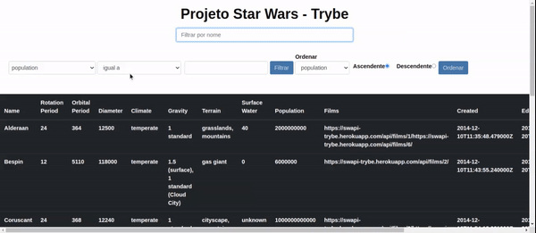
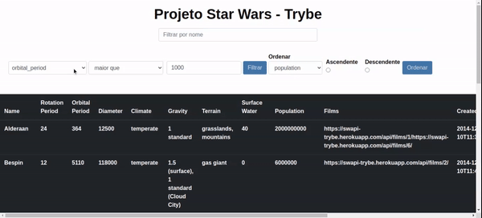
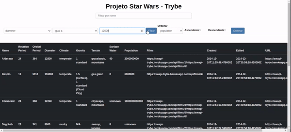
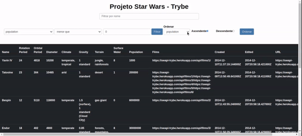

## Projeto Starwars Planets Search

Desenvolveu-se uma lista com filtros de planetas do universo de Star Wars usando **Context API e Hooks** para controlar os estados globais.

### Objetivos do Projeto

* Utilizar a _Context API_ do **React** para gerenciar estado.
* Utilizar o _React Hook useState_;
* Utilizar o _React Hook useContext_;
* Utilizar o _React Hook useEffect_;
* Criar _React Hooks_ customizados.

### Requisitos do Projeto

  `Requisitos obrigatórios:`
  - [1 - Faça uma requisição para o endpoint /planets da API de Star Wars e preencha uma tabela com os dados retornados, com exceção dos da coluna residents](#1---faça-uma-requisição-para-o-endpoint-planets-da-api-de-star-wars-e-preencha-uma-tabela-com-os-dados-retornados-com-exceção-dos-da-coluna-residents)
  - [2 - Filtre a tabela através de um texto, inserido num *campo de texto*, exibindo somente os planetas cujos nomes incluam o texto digitado](#2---filtre-a-tabela-através-de-um-texto-inserido-num-campo-de-texto-exibindo-somente-os-planetas-cujos-nomes-incluam-o-texto-digitado)
  - [3 - Crie um filtro para valores numéricos](#3---crie-um-filtro-para-valores-numéricos)
  - [4 - Não utilize filtros repetidos](#4---não-utilize-filtros-repetidos)
  - [5 - Apague o filtro de valores numéricos e desfaça as filtragens dos dados da tabela ao clicar no ícone de X de um dos filtros](#5---apague-o-filtro-de-valores-numéricos-e-desfaça-as-filtragens-dos-dados-da-tabela-ao-clicar-no-ícone-de-x-de-um-dos-filtros)
    
  `Requisitos bônus:`
  - [6 - Ordene as colunas de forma ascendente ou descendente](#6---ordene-as-colunas-de-forma-ascendente-ou-descendente)

---


### 1 - Faça uma requisição para o endpoint `/planets` da API de Star Wars e preencha uma tabela com os dados retornados, com exceção dos da coluna `residents`

A tabela deve ser renderizada por um componente chamado `<Table />`. Os dados recebidos da API devem ser salvos num campo chamado `data` do contexto e é daí que a tabela deve lê-los. A requisição deve ser feita num componente separado do componente da tabela.

A API a ser consultada está [nesse link](https://swapi-trybe.herokuapp.com/api/planets/). Ou seja, você deverá fazer um fetch para a URL `https://swapi-trybe.herokuapp.com/api/planets/`

A tabela deve ter uma primeira linha com os headers e as demais com as informações de cada campo.

O que será verificado:
```
- Realiza uma requisição para a API
- Preenche a tabela com os dados retornados
- Verifica se a tabela tem 13 colunas
- Verifica se a tabela tem uma linha para cada planeta retornado
```


### 2 - Filtre a tabela através de um texto, inserido num *campo de texto*, exibindo somente os planetas cujos nomes incluam o texto digitado

Ele deve atualizar a tabela com os planetas que se encaixam no filtro à medida que o nome é digitado, sem ter que apertar um botão para efetuar a filtragem. Por exemplo, se digitar "Tatoo", o planeta "Tatooine" deve ser exibido. Você deve usar **Context API e Hooks** para fazer o gerenciamento do estado da aplicação e o texto digitado deve ser salvo num campo `filters: { filterByName: { name } }`. Por exemplo:

```javascript
{
  filters: {
    filterByName: {
      name: 'Tatoo'
    }
  }
}
```

O campo de texto deve possuir a propriedade `data-testid='name-filter'` para que a avaliação automatizada funcione.

O que será verificado:
```
- Renderiza o campo de texto para o filtro de nomes
- Filtra os planetas que possuem a letra "o" no nome
- Filtra planetas que possuem a letra "oo" no nome
- Realiza vários filtros em sequência
```


### 3 - Crie um filtro para valores numéricos

Ele funcionará com três seletores:

  - O primeiro deve abrir um dropdown que permita a quem usa selecionar uma das seguintes colunas: `population`, `orbital_period`, `diameter`, `rotation_period` e `surface_water`. Deve ser uma tag `select` com a propriedade `data-testid='column-filter'`;
  - O segundo deve determinar se a faixa de valor será `maior que`, `menor que` ou `igual a` o numero que virá a seguir. Uma tag `select` com a propriedade `data-testid='comparison-filter'`;
  - O terceiro deve ser uma caixa de texto que só aceita números. Essa caixa deve ser uma tag `input` com a propriedade `data-testid='value-filter'`;
  - Deve haver um botão para acionar o filtro, com a propriedade `data-testid='button-filter'`.

A combinação desses três seletores deve filtrar os dados da tabela de acordo com a coluna correspondente e com os valores escolhidos. Por exemplo:
  - A seleção `population | maior que | 100000` - Seleciona somente planetas com mais de 100000 habitantes.
  - A seleção `diameter | menor que | 8000` - Seleciona somente planetas com diâmetro menor que 8000.

Você deve usar **Context API e Hooks** para fazer o gerenciamento do estado da aplicação. No contexto, esses valores devem ser salvos nos campos `filters { filterByName: { name }, filterByNumericValues: [{ column, comparison, value }] }`. Por exemplo:

```javascript
{
  filters:
    {
      filterByName: {
        name: ''
      },
      filterByNumericValues: [
        {
          column: 'population',
          comparison: 'maior que',
          value: '100000',
        }
      ]
    }
  }
}
```

O que será verificado:
```
- Renderiza o filtro de coluna
- Renderiza o filtro de comparação
- Renderiza o campo para o valor do filtro
- Renderiza o botão para executar a filtragem
- Filtra utilizando a comparação "menor que"
- Filtra utilizando a comparação "maior que"
- Filtra utilizando a comparação "igual a"
```


### 4 - Não utilize filtros repetidos

Caso um filtro seja totalmente preenchido, um novo filtro de valores numéricos deve ser carregado. Este novo filtro não deve incluir quaisquer colunas que já tenham sido selecionadas em filtros de valores numéricos anteriores. Caso todas as colunas já tenham sido inclusas em filtros anteriores, não deve ser carregado um novo filtro. Você deve usar **Context API e Hooks** para fazer o gerenciamento do estado da aplicação.

Por exemplo: O primeiro filtro tem as seguintes seleções: `population | maior que | 100000`. Um segundo filtro deve aparecer após essas seleções serem todas feitas e, no primeiro dropdown deste segundo filtro, a opção `population` deve estar ausente. Se no segundo filtro fosse selecionado `diameter | menor que | 8000`, o estado ficaria assim:

```javascript
{
  filters: {
    filterByName: {
      name: ''
    },
    filterByNumericValues: [
      {
        column: 'population',
        comparison: 'maior que',
        value: '100000',
      },
      {
        column: 'diameter',
        comparison: 'menor que',
        value: '8000',
      }
    ]
  }
}
```

O que será verificado:
```
- Filtra por população e o remove das opções
```



### 5 - Apague o filtro de valores numéricos e desfaça as filtragens dos dados da tabela ao clicar no ícone de `X` de um dos filtros

O `button` com o ícone de `x` deve existir em cada filtro de valores numéricos.

A coluna que este filtro selecionava deve passar a ficar disponível nos dropdowns dos demais filtros já presentes na tela. Você deve usar **Context API e Hooks** para fazer o gerenciamento do estado da aplicação. Cada filtro deve possuir a propriedade `data-testid='filter'`, com um `button` em seu interior com o texto `X`.

O que será verificado:
```
- Adiciona um filtro e verifica se a tabela foi atualizada com as informações filtradas, depois remove o filtro e verifica se os valores da tabela voltaram ao original.
- Adiciona dois filtros e verifica se a tabela foi atualizada com as informações filtradas, depois remove os filtros e verifica se os valores da tabela voltaram ao original.
```



### Bônus

### 6 - Ordene as colunas de forma ascendente ou descendente

A informação acerca da ordenação das colunas deve ser armazenada nos campos `filters: { filterByName: { name }, filterByNumericValues = [], order: { column: 'Name', sort: 'ASC'} }`, o campo column representa o nome da coluna a ordenar e a ordem representa a ordenação, sendo 'ASC' ascendente e 'DESC' descendente. Por padrão, a tabela começa ordenada pela coluna 'Name' em ordem ascendente. Por exemplo:

```javascript
{
  filters: {
    filterByName: {
      name: ''
    },
    filterByNumericValues : [],
    order: {
      column: 'name',
      sort: 'ASC',
    }
  }
}
```

Essa ordenação deve ser feita via filtro: um dropdown selecionará a coluna a basear a ordenação e um par de radio buttons determinará se esta é ascendente ou descendente.

O dropdown deve ser um elemento `select` com a propriedade `data-testid='column-sort'`, com as opções das colunas escolhíveis em seu interior. Deve haver também, dois `inputs` de tipo `radio`, com propriedades `data-testid='column-sort-input-asc'` e `data-testid='column-sort-input-desc'`, para definir o sentido da ordenação (com `value` sendo `ASC` ou `DESC`) e um botão para submeter a ordenação, com uma tag `button` e a propriedade `data-testid='column-sort-button'`.

Adicione o atributo `data-testid` com o valor `planet-name` em todos os elementos da tabela que possuem o nome de um planeta.

O que será verificado:
```
- Verifica ordenação inicial
- Ordena os planetas do mais populoso para o menos populoso
```


---

